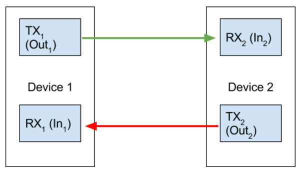
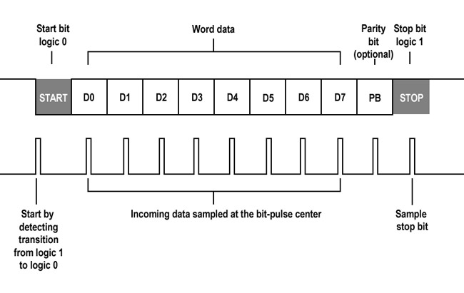
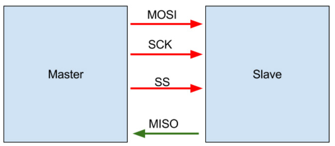
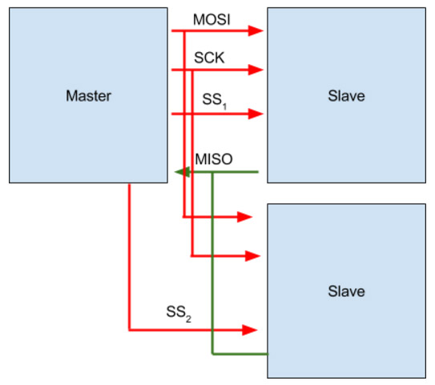
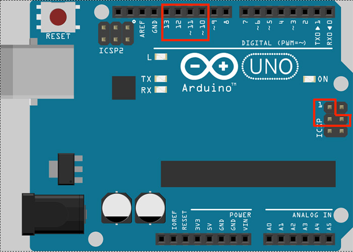
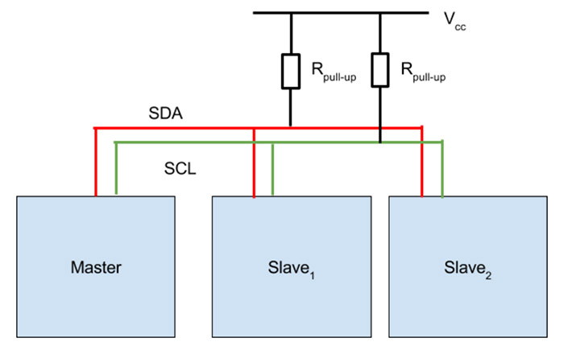
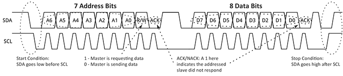

# Cos'è un sensore?

> Un sensore è un componente che fisicamente effettua la trasformazione della grandezza
> d'ingresso in un segnale di altra natura
> -- Wikipedia

---

# Tipologie di sensori

Esistono due diversi tipologie di sensori:

* __Sensori analogici__
* __Sensori digitali__

----

## Sensori analogici

I __sensori analogici__ leggono un valore di __tensione proporzionale__ alla grandezza misurata.

In Arduino (ed altri microcontrollori simili) il valore di tensione viene letto tra il __GND__ ed il __pin di output__ del sensore tramite l'utilizzo di un __pin analogico__ del microcontrollore (guardare il datasheet per vedere quanti e quali sono i pin analogici)

---

## Sensori analogici
### Analog to Digital Converter

La conversione dal valore di tensione ad un valore digitale viene effettuata tramite un __ADC__ (Analog to Digital Converter), che permette di discretizzare la tensione (tipicamente compresa tra 0 e 5 volt) su __2^n livelli__, dove `n` è il __numero di bit__ dell'ADC (10, nel caso di un Arduino Uno, che quindi può discretizzare la tensione su 1024 livelli)

---

## Sensori analogici
### Comunicazione

Per utilizzare un sensore è necessario anzitutto collegarlo al circuito, __seguendo le specifiche del datasheet__

Per leggere il valore di tensione trasmesso dal sensore analogico con l'IDE Arduino basta usare la funzione `analogRead(inputPin)`

----

## Sensori digitali

I __sensori digitali__ comunicano con la scheda tramite __protocolli standard__, basati su __bus__, __indirizzi__ ed __interrupts__.

L'utilizzo di sensori digitali permette di trasmettere __dati già elaborati__ lungo lo stesso "filo di comunicazione" (bus).

---

## Sensori digitali
### Comunicazione

Per comunicare con un sensore digitale va scaricata ed installata la libreria dedicata, che fornirà tutte le funzioni necessarie ad acquisire i dati letti dal sensore.

Se non esiste una libreria per un sensore, sarà necessario implementarla (ad esempio con la libreria __wire.h__ per i sensori I2C)

----

# Protocolli di comunicazione

Fortunatamente, i principali standard di comunicazione per sensori sono solo 3:

* __UART__
* __SPI__
* __I2C__

---

## Protocolli di comunicazione
### UART

Il protocollo __UART__ (Universal Asynchronous Receiver/Transmitter) è un protocollo che permette la __trasmissione asincrona__ su una porta seriale (pin digitali __GPIO 0 e GPIO 1__ su Arduino Uno).

Lavora su due canali: __TX__ in trasmissione e __RX__ in ricezione.

----

## Protocolli di comunicazione
### UART

----

## Protocolli di comunicazione
### UART

La comunicazione è asincrona, quindi __non scandita da un clock__, e di conseguenza, per assicurasi che i dati ricevuti siano gli stessi dati trasmessi, è necessario "spezzare" il flusso di dati in pacchetti di formato prestabilito.

----

## Protocolli di comunicazione
### UART

----

## Protocolli di comunicazione
### UART

Altre informazioni su UART:

* La comunicazione è __half duplex__, quindi due dispositivi __non possono trasmettere contemporaneamente__
* Si è limitati a due __due device__ per bus
* Non è necessario gestire i dati al singolo bit, ma è possibile __astrarre tramite librerie C++__ (come __Serial__ e __SoftwareSerial__)

---

## Protocolli di comunicazione
### SPI

Il protocollo __SPI__ (Serial Peripheral Interface) è molto diverso da UART.

* È __sincrono__
* Segue un modello __master-slave__, con un device master e uno o più device slave
* Richiede più di due canali per essere implementato
* È __full duplex__, quindi la trasmissione è __bidirezionale__

----

## Protocolli di comunicazione
### SPI

----

## Protocolli di comunicazione
### SPI

* __MOSI__(Master In, Slave Out): canale di trasmissione dati da master a slave
* __SCK__ (SPI Clock): stabilisce la velocità di trasmissione e la sincronizza.
* __SS__ (Slave Select): seleziona lo slave con cui il master comunicherà
* __MISO__(Master In, Slave Out): canale di trasmissione dati da slave a master

----

## Protocolli di comunicazione
### SPI - Esempio con più slaves

----

## Protocolli di comunicazione
### SPI - Esempio con più slaves

Il master necessita di una singolo canale MISO, anche in presenza di più slaves

----

## Protocolli di comunicazione
### SPI - Clock

In __SPI__ il segnale di clock è definito da due proprietà:
* __CPOL__ (Clock POLarity): indica il livello
 (__HIGH__ o __LOW__) che corrisponde allo stato di idle, in cui il master non comunica con alcuno slave
* __CPHA__ (Clock PHAse): indica il fronte di clock (__salita__ o __discesa__) sul quale vengono letti i dati

Spiegazione più approfondita [qui](https://www.deviceplus.com/how-tos/arduino-guide/arduino-communication-protocols-tutorial/)

----

## Protocolli di comunicazione
### SPI - Implementazione su Arduino

Per implementare una connessione SPI su Arduino vanno usati 4 pin digitali, uno per canale:
* __SCK:__ GPIO 13 o ICSP 3
* __MOSI:__ GPIO 11 o ICSP 4
* __MISO:__ GPIO 12 o ICSP 1
* __SS:__ un qualsiasi pin digitale, settato a __LOW__ per essere letto (nell'esempio GPIO 10)

----

## Protocolli di comunicazione
### SPI - Implementazione su Arduino

---

## Protocolli di comunicazione
### I2C

__Inter-integrated circuit__ (I2C) è un protocollo di comunicazione che risolve molti dei problemi dei due protocolli precedentemente elencati.

* Permette di connettere __più master a più slave__
* Come SPI, è __sincrono__
* È semplice da implementare: bastano __due cavi__ e un po' di resistori

----

## Protocolli di comunicazione
### I2C

Come detto prima, I2C richiede due soli cavi:

* __SDA__, per i dati
* __SCL__, per il clock

Il circuito deve essere sempre __open drain__ (i canali possono essere settati solo a LOW dai dispositivi). Questo richiede l'uso di __resistori di pull-up__ (normalmente da 4.7 kOhm), che garantiscono che i canali siano in HIGH quando sono in stato di idle

----

## Protocolli di comunicazione
### I2C

----

## Protocolli di comunicazione
### I2C

Il protocollo I2C utilizza degli __indirizzi__ per interfacciarsi con diversi slaves. Questo permette di utilizzare un singolo canale digitale per la selezione dello slave, al contrario di SPI, che necessita di un canale per slave.

----

## Protocolli di comunicazione
### I2C - Implementazione su Arduino

I2C viene implementato su Arduino tramite la libreria __Wire.h__ (a meno che non ci sia una libreria già scritta da qualcun'altro per lo specifico sensore), utilizzando il pin analogico A4 per SDA e il pin analogico A5 per SCL.

È possibile connettere più di uno un master allo stesso bus I2C, ma __solo un master alla volta può comunicare con uno degli slave__, per evitare di generare una coda di accesso al bus. Inoltre, i device master __non__ possono comunicare tra di loro sullo stesso bus I2C.

---

# Fonti e risorse utili

* [Slides](https://slides.poul.org/2018/corsi-arduino/sensori/) di Raffaele Di Campli - corsi Arduino 2018
* [Tutorial](https://www.deviceplus.com/how-tos/arduino-guide/arduino-communication-protocols-tutorial/) esteso sui protocolli di comunicazione

